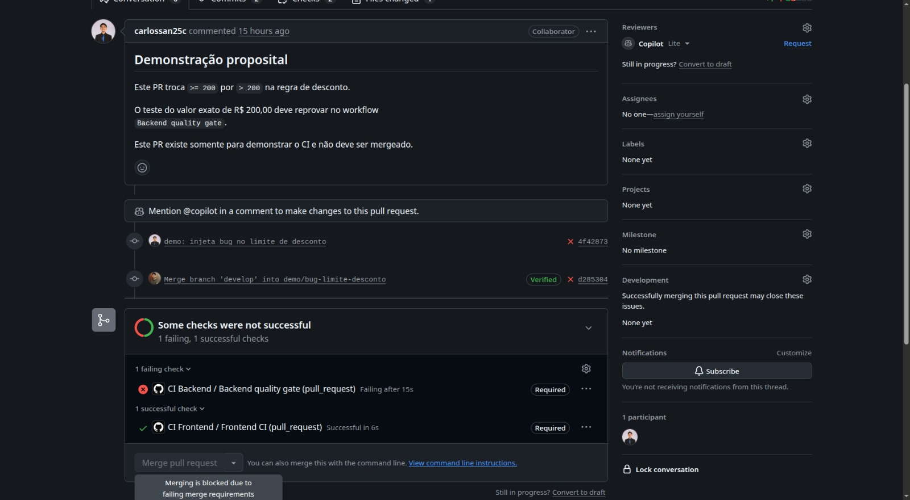

# Evidências das tasks C1 e C2 - Carlos

Este documento registra o estado das tasks de quality gate, demonstração de bug,
CI do frontend e branch protection. Os dados foram conferidos em 16/08/2026 após a
configuração administrativa das regras de proteção.

## Resumo executivo

| Task | Entrega técnica | Evidência | Estado |
|---|---|---|---|
| C1 | Quality gate de 75% no backend e roteiro da demonstração | PR #28 verde e PR #30 bloqueado | Concluída |
| C2 | CI do frontend com instalação, lint, teste e build | PR #29 verde e ruleset da `main` ativo | Parte do Carlos concluída; falta o check E2E da J2 |

As alterações corretas foram incorporadas apenas em `develop`. O bug proposital está
isolado na branch `demo/bug-limite-desconto` e nunca deve ser mergeado.

## C1 - Quality gate e bug proposital

### O que foi implementado

- Workflow `.github/workflows/ci-backend.yml`.
- Ruff para análise estática.
- Pytest para execução dos testes.
- Cobertura do pacote `app` com limite mínimo de 75%.
- Relatório `coverage.xml` publicado como artifact.
- Detecção de mudanças para evitar execução pesada quando o backend não foi alterado.
- Roteiro em `docs/roteiro-demonstracao-ci.md`.

### Por que o limite é 75%

A cobertura medida durante a implementação foi 75,86%. O limite de 75% permite que o
estado atual seja aprovado, mas faz uma pequena inclusão de código sem testes reprovar
o pipeline. Um teste controlado com limite temporário de 77% retornou falha, provando
que o gate funciona.

### Evidência de aprovação

- [PR #28 - implementação do quality gate](https://github.com/lfariazzz/automated_tests_CI_CD_pipelines/pull/28)
- [Check Backend quality gate aprovado](https://github.com/lfariazzz/automated_tests_CI_CD_pipelines/actions/runs/31920972053/job/95100685002)
- Resultado local: 10 testes aprovados e cobertura de 75,86%.

### Evidência de reprovação

- [PR #30 - bug proposital](https://github.com/lfariazzz/automated_tests_CI_CD_pipelines/pull/30)
- [Check Backend quality gate reprovado](https://github.com/lfariazzz/automated_tests_CI_CD_pipelines/actions/runs/31962503071/job/95202522146)
- [Check Frontend CI aprovado no mesmo PR](https://github.com/lfariazzz/automated_tests_CI_CD_pipelines/actions/runs/31962503068/job/95202522365)

O PR #30 altera somente uma comparação:

```diff
-    if subtotal >= 200.0:
+    if subtotal > 200.0:
```

No subtotal exato de R$ 200,00, o código com bug retorna desconto zero, enquanto o
teste espera R$ 20,00. O backend reprova e o frontend permanece verde, mostrando que
os pipelines são independentes.

### Evidência do bloqueio administrativo



O print comprova simultaneamente que os dois checks são obrigatórios e que o GitHub
desabilitou o merge por causa da falha do backend.

## C2 - CI do frontend e branch protection

### O que foi implementado

- Workflow `.github/workflows/ci-frontend.yml`.
- Node.js 24 e cache de dependências npm.
- Instalação reproduzível com `npm ci`.
- Lint com Oxlint.
- Teste de componente com Vitest e Testing Library.
- Build de produção com Vite.
- Detecção de mudanças compatível com checks obrigatórios.
- Instruções administrativas em `docs/branch-protection.md`.

### Evidência de aprovação

- [PR #29 - CI do frontend](https://github.com/lfariazzz/automated_tests_CI_CD_pipelines/pull/29)
- [Check Frontend CI aprovado](https://github.com/lfariazzz/automated_tests_CI_CD_pipelines/actions/runs/31921152188/job/95101111332)
- [Check Backend quality gate aprovado no mesmo PR](https://github.com/lfariazzz/automated_tests_CI_CD_pipelines/actions/runs/31921152142/job/95101111222)

O PR comprovou que `npm ci`, lint, teste e build terminam com sucesso no GitHub
Actions.

## Estado após a configuração administrativa

Na data deste registro:

- o ruleset [Proteção temporária da develop](https://github.com/lfariazzz/automated_tests_CI_CD_pipelines/rules/20913430) está ativo;
- o ruleset [Proteção da main](https://github.com/lfariazzz/automated_tests_CI_CD_pipelines/rules/20913489) está ativo;
- ambos exigem pull request, branch atualizada e os checks `Backend quality gate` e
  `Frontend CI`;
- ambos impedem exclusão e force push das branches protegidas;
- o PR #30 está com o backend vermelho, o frontend verde e o merge bloqueado;
- o autor das tasks possui permissão de escrita, mas não permissão administrativa;
- o workflow E2E da J2 ainda não existe em `develop`.

Com isso, todos os critérios da C1 foram atendidos. Na C2, o workflow do frontend e a
parte da proteção que dependiam do Carlos também foram concluídos. A única pendência é
externa: depois que a J2 publicar e executar o workflow `e2e.yml`, o administrador deve
adicionar ao ruleset da `main` o nome exato do check E2E reportado pelo GitHub Actions.

## Prints que devem ser guardados

| Identificador | Conteúdo do print | Estado |
|---|---|---|
| C1-01 | PR #28 com Backend quality gate verde | Pendente anexar |
| C1-02 | Diff do PR #30 mostrando `>=` para `>` | Pendente anexar |
| C1-03 | Log do teste reprovado no valor R$ 200,00 | Pendente anexar |
| C1-04 | PR #30 com Backend vermelho e Frontend verde | Anexado neste documento |
| C1-05 | Mensagem de merge bloqueado após o ruleset | Anexado neste documento |
| C2-01 | PR #29 com Frontend CI verde | Pendente anexar |
| C2-02 | Log contendo `npm ci`, lint, teste e build aprovados | Pendente anexar |
| C2-03 | Ruleset definitivo da `main` com três checks | Depende do administrador e da J2 |

Os arquivos de imagem estão organizados em `docs/evidencias/carlos/` e podem ser
reutilizados na consolidação do documento geral de evidências.

## Roteiro simples para a apresentação

### Fala sugerida - aproximadamente 2 minutos

> Minha primeira task foi configurar o quality gate do backend. O workflow executa
> lint, testes e mede a cobertura, exigindo no mínimo 75%. No PR #28, o código correto
> passou com cobertura de 75,86%.
>
> Para provar que o pipeline detecta uma regressão real, criamos o PR #30 em uma
> branch separada. A única mudança foi trocar maior ou igual por maior na faixa de
> desconto de R$ 200,00. O código continua sintaticamente válido, mas falha exatamente
> no caso de borda: o teste esperava R$ 20,00 de desconto e recebeu zero. Por isso, o
> backend ficou vermelho, enquanto o frontend permaneceu verde.
>
> Minha segunda task foi criar o CI do frontend. Ele instala as dependências com
> `npm ci`, executa lint, testes Vitest e o build de produção. O PR #29 comprova que
> todas essas etapas passaram no GitHub Actions.
>
> Por fim, os checks agora são obrigatórios pela branch protection. Assim, um erro que
> poderia passar despercebido deixa de depender de revisão manual e é bloqueado antes
> de chegar à branch principal.

### Sequência da demonstração ao vivo

1. Mostrar o PR #28 e o check verde.
2. Mostrar no PR #30 a alteração de uma única linha.
3. Abrir o log vermelho e destacar o caso de R$ 200,00.
4. Mostrar que o Frontend CI continuou verde.
5. Mostrar a mensagem de merge bloqueado pelo ruleset.
6. Mostrar o PR #29 e resumir as quatro etapas do frontend.

## Respostas rápidas para possíveis perguntas

**Por que criar um bug proposital?**

Para demonstrar com evidência reproduzível que o CI detecta uma regressão e impede que
ela chegue às branches oficiais. O bug nunca é mergeado.

**Por que usar um caso de borda?**

Porque trocar `>=` por `>` é um erro pequeno, válido sintaticamente e fácil de escapar
em revisão manual, mas deve ser detectado por um bom teste automatizado.

**Por que o frontend ficou verde quando o backend falhou?**

Os workflows identificam quais áreas mudaram. O check do frontend ainda reporta um
resultado válido, mas pula as etapas pesadas quando não houve mudança no frontend.

**O trabalho está totalmente concluído?**

A C1 está totalmente concluída. Na C2, todas as partes do Carlos estão concluídas; o
ruleset completo da `main` depende somente do workflow E2E da J2.

## Encerramento das issues

A issue #6 pode ser encerrada após o merge desta atualização de evidências. A issue #7
deve permanecer aberta com o estado documentado até a J2 entregar o E2E e o
administrador adicionar o terceiro check ao ruleset da `main`.

## Encerramento correto do PR de demonstração

O PR #30 não deve ser mergeado. Depois da apresentação e da coleta dos prints, ele
pode ser fechado com o comentário:

> PR encerrado sem merge. Criado exclusivamente para demonstrar que o pipeline de CI
> detecta uma regressão em um caso de borda.
