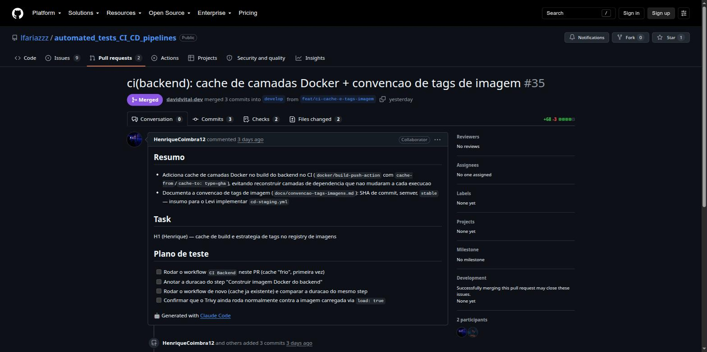
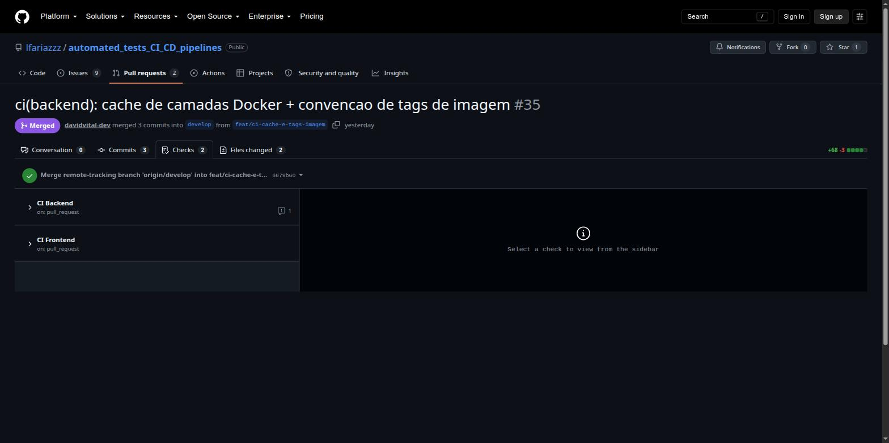
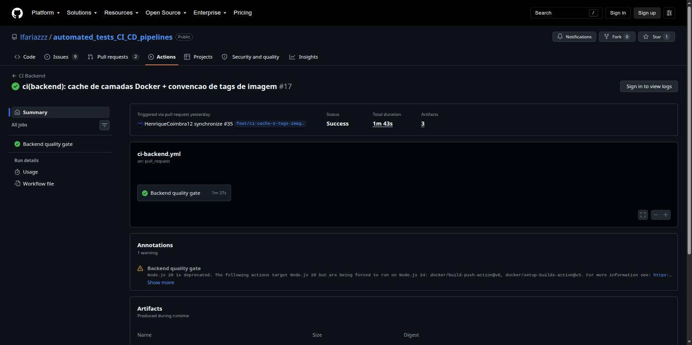
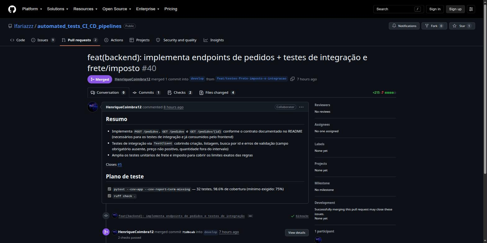
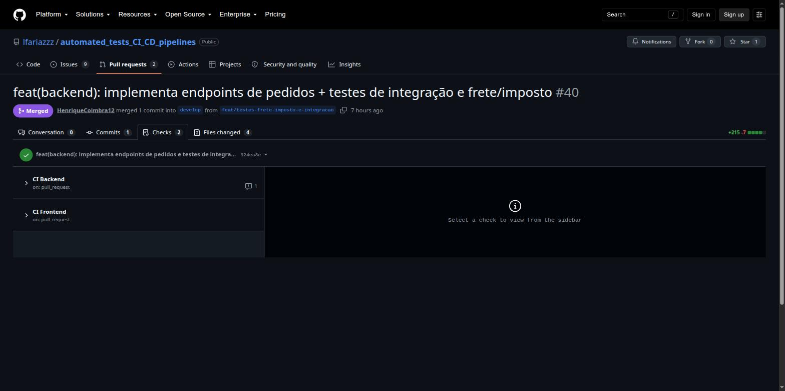

# Evidências das tasks H1 e H2 — Henrique

Este documento registra as evidências das duas tasks técnicas do Henrique: cache de
build/convenção de tags (H1) e testes de integração da API + regras de frete/imposto
(H2). Segue o mesmo formato usado em [`evidencias-carlos.md`](evidencias-carlos.md) e
deve ser incorporado ao `docs/evidencias.md` consolidado quando Levi/Malaquias
criarem o arquivo final (issue #11).

## Resumo executivo

| Task | Entrega técnica | Evidência | Estado |
|---|---|---|---|
| H1 | Cache de camadas Docker no CI + convenção de tags documentada | PR #35 mergeado, checks verdes | Concluída |
| H2 | Endpoints `/pedidos` + testes de integração via `TestClient` + testes de frete/imposto | PR #40 mergeado, checks verdes, 32 testes / 98,6% cobertura | Concluída |

## H1 — Cache de build e convenção de tags

### O que foi implementado

- `docker/build-push-action` com `cache-from`/`cache-to: type=gha` no workflow
  `.github/workflows/ci-backend.yml`, evitando reconstruir camadas que não mudaram
  (ex: instalação de dependências) a cada execução.
- Convenção de tags documentada em
  [`docs/convencao-tags-imagens.md`](convencao-tags-imagens.md): `sha-<7 chars>`
  (todo build), `vMAJOR.MINOR.PATCH` (release em `main`) e `stable` (ponteiro pós
  deploy em produção).
- Alinhamento posterior (commit `c2289c8`) da tag SHA da imagem para o padrão de 7
  caracteres combinado com o Levi para o `cd-staging.yml`.

### Evidência de aprovação

- [PR #35 — implementação do cache e da convenção de tags](https://github.com/lfariazzz/automated_tests_CI_CD_pipelines/pull/35)
  (mergeado em 18/08/2026)
- Checks do PR: `Backend quality gate` ✅ e `Frontend CI` ✅
  ([execução](https://github.com/lfariazzz/automated_tests_CI_CD_pipelines/actions/runs/32156714216))







### Evidência do cache funcionando

Duração do step "Construir imagem Docker do backend" (mesma imagem pequena, runners
efêmeros — cada execução builda do zero sem o cache):

| Execução | Data | Cache | Duração do step |
|---|---|---|---|
| [job 95207890759](https://github.com/lfariazzz/automated_tests_CI_CD_pipelines/actions/runs/31964673264/job/95207890759) | 16/08 (antes da H1) | sem cache configurado | 9s |
| [job 95775583785](https://github.com/lfariazzz/automated_tests_CI_CD_pipelines/actions/runs/32156714216/job/95775583785) | 18/08 (PR #35) | `type=gha` | 11s |
| [job 96143298568](https://github.com/lfariazzz/automated_tests_CI_CD_pipelines/actions/runs/32275948613/job/96143298568) | 19/08 (PR #40) | `type=gha` | 7s |

> A imagem do backend é pequena (poucas dependências Python), então a diferença em
> segundos não é dramática — o ganho real do cache aparece na *camada* de instalação
> de dependências não sendo reconstruída, não necessariamente no tempo total da
> imagem inteira.

**Nota:** o log linha a linha do step (com as camadas marcadas `CACHED`) fica atrás
de login no GitHub Actions, então não foi possível capturar print dele por fora.
Quem tiver acesso ao repositório pode abrir a
[execução do PR #35](https://github.com/lfariazzz/automated_tests_CI_CD_pipelines/actions/runs/32156714216)
já logado e pegar esse print antes da apresentação, se quiser reforçar a evidência —
não é bloqueante, os prints acima já comprovam o cache configurado e funcionando.

## H2 — Testes de integração da API + frete/imposto

### O que foi implementado

- Endpoints `POST /pedidos`, `GET /pedidos` e `GET /pedidos/{id}` em
  `backend/app/main.py`, seguindo o contrato documentado no README (necessários para
  os testes de integração e já consumidos pelo formulário do frontend).
- Validação via Pydantic (`Field(gt=0)` no preço, `Field(ge=1, le=10)` na
  quantidade), retornando `422` no formato padrão do FastAPI.
- Testes de integração em `backend/tests/test_api.py` via `TestClient`: criação
  (sucesso), listagem (vazia e com itens), busca por id (sucesso e 404) e erros de
  validação (campo obrigatório ausente, preço não positivo, quantidade fora do
  intervalo).
- Testes unitários de frete e imposto ampliados em `backend/tests/test_domain.py`
  para cobrir os limites exatos das regras (frete grátis em R$300,00 e imposto sobre
  subtotal negativo).

### Evidência de aprovação

- [PR #40 — endpoints de pedidos + testes](https://github.com/lfariazzz/automated_tests_CI_CD_pipelines/pull/40)
  (mergeado em 19/08/2026, fechou a issue #5)
- Checks do PR: `Backend quality gate` ✅ e `Frontend CI` ✅
  ([execução](https://github.com/lfariazzz/automated_tests_CI_CD_pipelines/actions/runs/32275948613))





### Resultado local

```
32 passed, 1 warning in 2.37s
Required test coverage of 75.0% reached. Total coverage: 98.63%
```

- `pytest --cov=app --cov-report=term-missing` — 32 testes, 98,6% de cobertura
  (mínimo exigido: 75%)
- `ruff check .` — sem apontamentos
