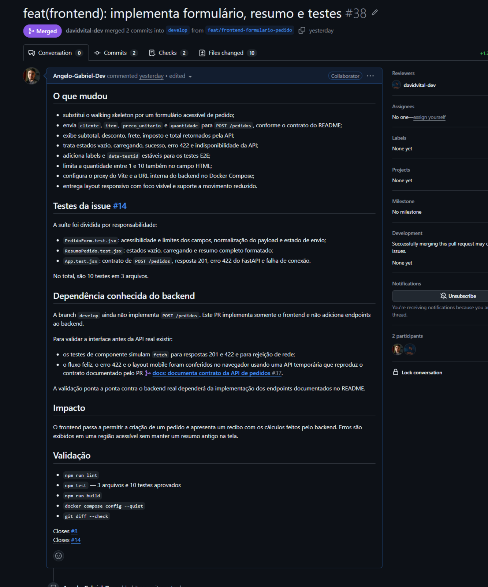
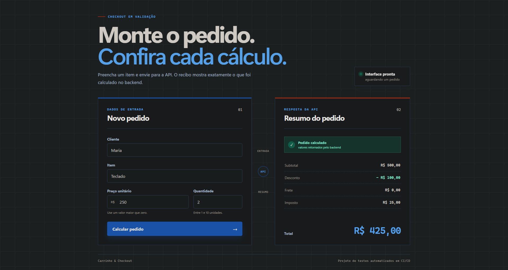
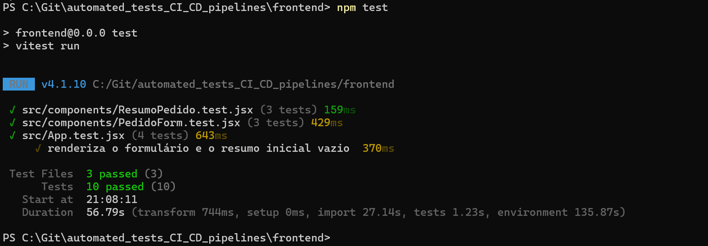

# Evidências das tasks A1 e A2 — Angelo

Este documento registra as evidências das duas tasks técnicas de Angelo: formulário
de pedido com exibição do resumo (A1) e testes unitários/de componente do frontend
(A2). Segue o formato dos documentos individuais já presentes nesta pasta e deve ser
incorporado ao `docs/evidencias.md` consolidado quando Levi e Malaquias organizarem o
material final da issue #11.

## Resumo executivo

| Task | Entrega técnica | Evidência | Estado |
|---|---|---|---|
| A1 | Formulário acessível integrado a `POST /pedidos`, tratamento de estados e resumo dos cálculos | PR #38 mergeado e fluxo real executado na `develop` | Concluída |
| A2 | Testes do formulário, do resumo e da integração da aplicação com a API | 3 arquivos e 10 testes aprovados | Concluída |

As duas tasks foram entregues juntas no PR #38, mergeado em `develop` em 18/08/2026.
O PR fechou as issues #8 e #14 e recebeu aprovação após os checks do frontend e do
backend terminarem com sucesso.

## A1 — Formulário de pedido e exibição do resumo

### O que foi implementado

- Formulário React com os campos `cliente`, `item`, `preco_unitario` e `quantidade`.
- Associação dos campos a `label`, mensagens auxiliares e `data-testid` estáveis para
  acessibilidade e automação dos testes.
- Validação HTML de campos obrigatórios, preço maior que zero e quantidade entre 1 e
  10 unidades.
- Normalização dos textos e conversão dos valores numéricos antes do envio.
- Requisição `POST /pedidos` em JSON por meio da Fetch API.
- Proxy `/api` do Vite, apontando para o backend local ou para o serviço do Docker
  Compose.
- Estados visuais de resumo vazio, carregamento, sucesso e erro.
- Tratamento de erro de validação `422`, resposta incompleta e indisponibilidade da
  API.
- Exibição de subtotal, desconto, frete, imposto e total formatados em reais.
- Layout responsivo, foco visível e suporte a preferência por movimento reduzido.

### Evidência 1 — PR #38 mergeado

- [PR #38 — formulário, resumo e testes](https://github.com/lfariazzz/automated_tests_CI_CD_pipelines/pull/38)
- [Frontend CI aprovado](https://github.com/lfariazzz/automated_tests_CI_CD_pipelines/actions/runs/32151294984/job/95757550159)
- [Backend quality gate aprovado](https://github.com/lfariazzz/automated_tests_CI_CD_pipelines/actions/runs/32151295266/job/95757551304)



O print registra o PR criado por Angelo a partir da branch
`feat/frontend-formulario-pedido`, os dois commits da implementação e o merge em
`develop`. A descrição relaciona o escopo entregue às issues #8 e #14 e registra as
validações executadas.

### Evidência 2 — Fluxo completo funcionando



O fluxo foi reproduzido na versão atual de `develop`, com frontend e backend reais
executados pelo Docker Compose. Foram utilizados os seguintes dados:

| Campo | Valor |
|---|---:|
| Cliente | Maria |
| Item | Teclado |
| Preço unitário | R$ 250,00 |
| Quantidade | 2 |

A interface enviou o pedido para a API e apresentou a confirmação `Pedido calculado`
com os valores retornados pelo backend:

| Cálculo | Resultado |
|---|---:|
| Subtotal | R$ 500,00 |
| Desconto | R$ 100,00 |
| Frete | R$ 0,00 |
| Imposto | R$ 25,00 |
| Total | R$ 425,00 |

Essa evidência comprova que o frontend implementado na A1 respeita o contrato da API,
envia os dados e renderiza corretamente a resposta. Os cálculos são responsabilidade
do backend; o frontend não replica as regras de negócio, apenas apresenta o resultado
recebido.

## A2 — Testes unitários e de componente do frontend

### O que foi testado

A suíte foi dividida por responsabilidade:

- `PedidoForm.test.jsx` — 3 testes para acessibilidade e limites dos campos,
  normalização do payload e estado de envio em andamento.
- `ResumoPedido.test.jsx` — 3 testes para os estados vazio, carregando e resumo
  completo com valores formatados.
- `App.test.jsx` — 4 testes para renderização inicial, contrato do `POST /pedidos`,
  resposta de validação `422` e falha de conexão com a API.

Os testes da aplicação simulam o `fetch` para validar o comportamento do frontend de
forma determinística, sem depender da disponibilidade do backend durante a suíte de
componentes.

### Evidência 3 — Suíte aprovada



O comando executado na pasta `frontend` foi:

```powershell
npm test
```

Resultado registrado:

```text
Test Files  3 passed (3)
Tests      10 passed (10)
```

O resultado atende ao critério de aceite da A2 porque cobre renderização correta,
estado vazio, carregamento, sucesso, erro de validação e indisponibilidade da API.

## Resultado

As três evidências cobrem autoria, integração e comportamento:

1. o PR #38 comprova a implementação e o merge das tasks A1 e A2;
2. a aplicação em execução comprova o formulário integrado à API e o resumo exibido;
3. o terminal comprova que os 10 testes automatizados passam nos 3 arquivos da suíte.

Com isso, as issues [#8](https://github.com/lfariazzz/automated_tests_CI_CD_pipelines/issues/8)
e [#14](https://github.com/lfariazzz/automated_tests_CI_CD_pipelines/issues/14)
ficam documentadas como concluídas, sem atribuir ao frontend a implementação das
regras de cálculo pertencentes ao backend.
