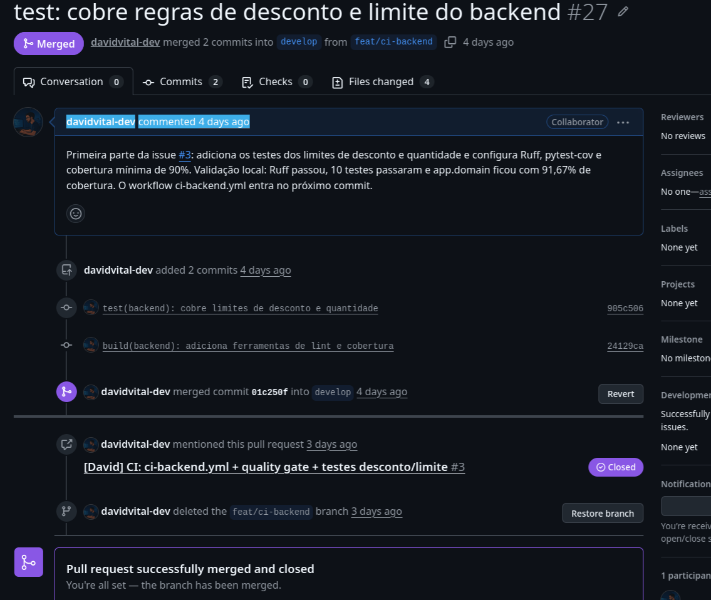
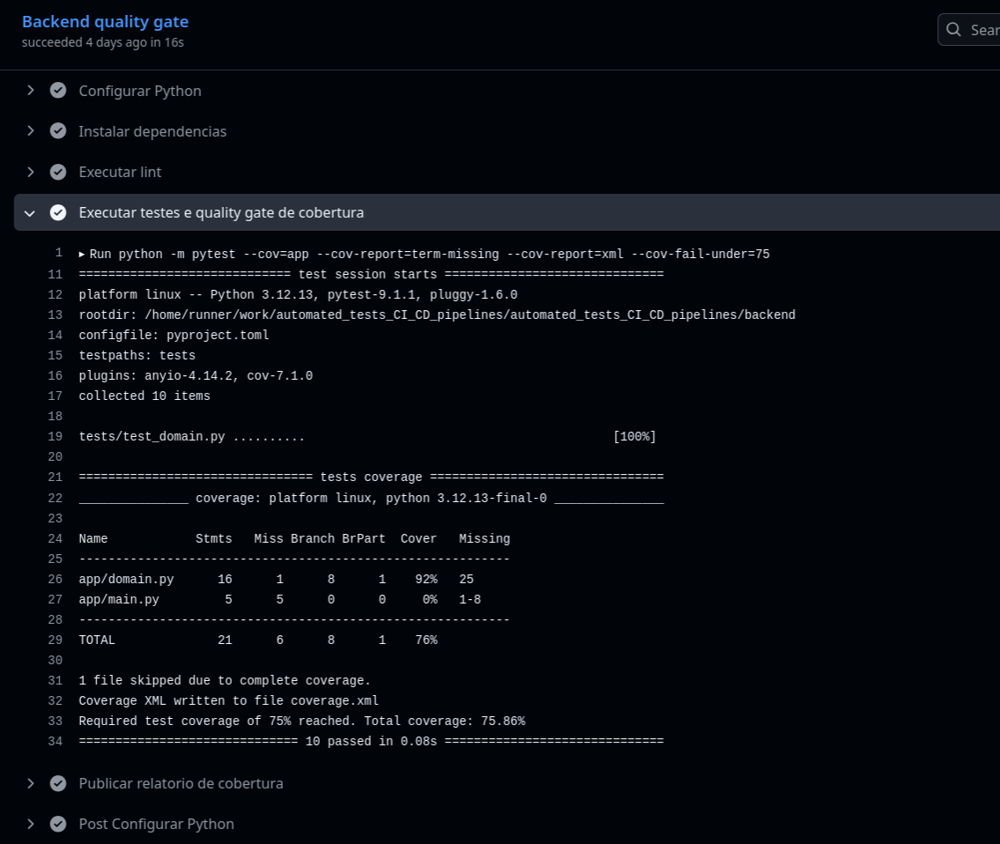

# Evidências da task D2 — David

Este documento registra as evidências da participação de David na issue #3,
responsável pelos testes de desconto/limite do backend e pela integração dessas
verificações ao fluxo de CI do projeto.

A contribuição implementada diretamente por David está registrada no PR #27. O
quality gate foi integrado na sequência, no PR #28, e a execução do GitHub Actions é
usada aqui para comprovar que os testes do backend passam a ser executados
automaticamente pela pipeline. A configuração e a demonstração específica do quality
gate pertencem à task do Carlos.

## Resumo executivo

| Task | Entrega técnica | Evidência | Estado |
|---|---|---|---|
| D2 | Testes unitários de desconto e limite + configuração de Ruff/pytest-cov | PR #27 mergeado | Concluída |
| D2 no CI | Testes do backend executados automaticamente pelo quality gate | Job do GitHub Actions com 10 testes aprovados e cobertura acima do mínimo | Integrada ao CI |

## D2 — Testes de desconto e limite do backend

### O que foi implementado diretamente

No PR #27 foram adicionadas e organizadas as ferramentas de teste e qualidade do
backend, incluindo:

- configuração do Ruff para análise estática;
- configuração do pytest e pytest-cov;
- separação das dependências de desenvolvimento em `requirements-dev.txt`;
- testes parametrizados para os casos de borda da regra de desconto;
- testes parametrizados para os limites mínimo e máximo de quantidade de itens.

Os casos de borda adicionados para desconto foram:

- `199.99` — imediatamente abaixo da primeira faixa;
- `200.00` — limite exato da faixa de 10%;
- `499.99` — imediatamente abaixo da segunda faixa;
- `500.00` — limite exato da faixa de 20%.

Para a quantidade de itens foram testados:

- `0` — inválido;
- `1` — mínimo válido;
- `10` — máximo válido;
- `11` — inválido.

Esses valores foram escolhidos para detectar regressões típicas de comparação, como a
troca indevida de `>=` por `>` nos limites das regras.

## Evidência 1 — PR #27 mergeado

[PR #27 — test: cobre regras de desconto e limite do backend](https://github.com/lfariazzz/automated_tests_CI_CD_pipelines/pull/27)

O print registra o PR #27 mergeado em `develop` a partir da branch `feat/ci-backend`,
com dois commits. A própria descrição do PR registra a validação local realizada na
época: Ruff aprovado, 10 testes aprovados e `app.domain` com 91,67% de cobertura.

Essa é a principal evidência de autoria da implementação dos testes da issue #3.

## Evidência 2 — Testes executados pelo Backend quality gate

[Backend quality gate aprovado no GitHub Actions](https://github.com/lfariazzz/automated_tests_CI_CD_pipelines/actions/runs/31920972053/job/95100685002)

O log comprova que os testes do backend passaram a fazer parte da execução automática
do CI. Na execução registrada:

- o job `Backend quality gate` terminou com sucesso;
- foram coletados **10 testes**;
- os **10 testes passaram**;
- `app/domain.py` apresentou aproximadamente **92% de cobertura**;
- a cobertura total registrada foi **75,86%**;
- o mínimo exigido pelo gate era **75%**;
- o relatório `coverage.xml` foi gerado para publicação como artifact.

Essa execução pertence ao PR #28, em que o quality gate foi integrado pelo Carlos, e
é utilizada aqui somente como evidência de que os testes implementados na D2 são
executados automaticamente pela pipeline. O cenário de demonstração do quality gate
e sua configuração específica continuam documentados como contribuição do Carlos.

## Resultado

As evidências mostram duas etapas complementares da D2:

1. o PR #27 comprova a implementação dos testes de casos de borda e da infraestrutura
   de testes/qualidade do backend por David;
2. o job do GitHub Actions comprova que esses testes foram incorporados ao fluxo de CI
   e executados automaticamente com sucesso.

Com isso, a contribuição técnica de David na issue #3 fica documentada sem confundir a
autoria dos testes com a task de demonstração do quality gate realizada pelo Carlos.
