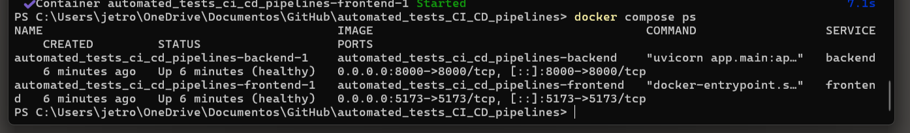
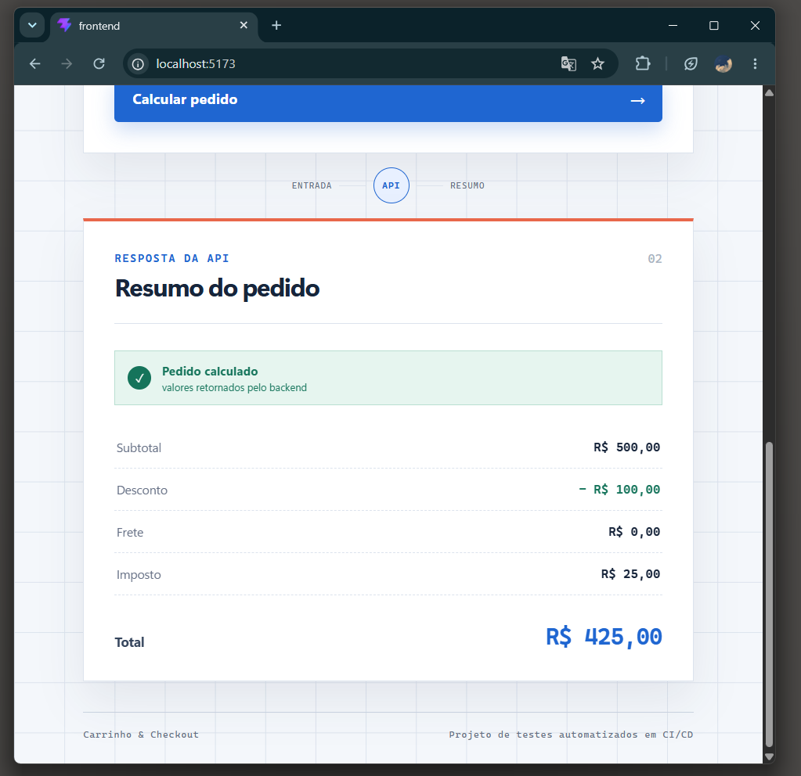
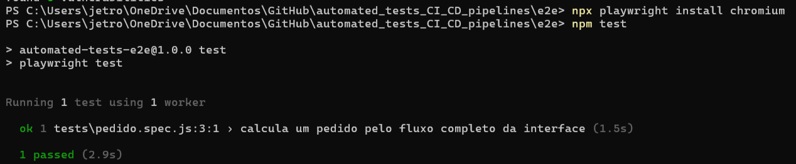

# Evidências das tasks J1 e J2 - Jetro

Este documento registra o estado das tasks de Docker Compose, testes E2E e CI E2E.
Os dados foram conferidos em 19/08/2026 na branch `codex/jetro-e2e-pipeline`.

## Resumo executivo

| Task | Entrega técnica | Evidência | Estado |
|---|---|---|---|
| J1 | Docker Compose com backend/frontend e teste Playwright do fluxo completo | `docker compose up --build` e `npm test` no pacote `e2e` | Concluída na branch |
| J2 | Workflow `.github/workflows/e2e.yml` executando o E2E no GitHub Actions | Check `E2E` e artifact `playwright-report-${{ github.sha }}` | Concluída na branch; falta anexar prints |

A entrega valida o sistema completo pelo ponto de vista do usuário: a aplicação sobe
com backend e frontend integrados, o frontend consome a API real e o Playwright
preenche um pedido até conferir o resumo calculado na tela.

## J1 - Docker Compose e teste E2E

### O que foi implementado

- `docker-compose.yml` subindo backend e frontend juntos.
- Healthcheck do backend em `http://localhost:8000/health`.
- Healthcheck do frontend em `http://localhost:5173`.
- Dependência do frontend em relação ao backend saudável.
- Proxy do frontend apontando para `http://backend:8000` dentro da rede do Compose.
- Pacote E2E em `e2e/` com Playwright.
- Teste `e2e/tests/pedido.spec.js` cobrindo o fluxo completo de pedido.
- Guia de reprodução em `docs/pipeline/como-reproduzir.md`.

### Fluxo validado pelo Playwright

O teste abre a aplicação, preenche os campos `Cliente`, `Item`, `Preço unitário` e
`Quantidade`, envia o formulário e confere os valores calculados:

| Campo validado | Valor esperado |
|---|---:|
| Subtotal | R$ 500,00 |
| Desconto | R$ 100,00 |
| Frete | R$ 0,00 |
| Imposto | R$ 25,00 |
| Total | R$ 425,00 |

Esse cenário usa preço unitário de R$ 250,00 e quantidade 2. Ele passa por frontend,
API, regras de negócio e renderização do resumo, sem mock da API.

### Evidência local

- Arquivo principal: `e2e/tests/pedido.spec.js`.
- Configuração: `e2e/playwright.config.js`.
- Comando de execução local:

```bash
docker compose up --build --detach
cd e2e
npm ci
npx playwright install chromium
npm test
```

O relatório HTML pode ser aberto com:

```bash
npm run test:report
```

## J2 - Workflow E2E no GitHub Actions

### O que foi implementado

- Workflow `.github/workflows/e2e.yml`.
- Disparo em `push` para `develop` e `main` quando backend, frontend, E2E, Compose ou
  o próprio workflow mudam.
- Disparo em pull requests para `develop` e `main`.
- Execução manual por `workflow_dispatch`.
- Detecção de alterações relevantes para evitar trabalho pesado em PRs sem impacto no
  fluxo integrado.
- Node.js 24 com cache npm usando `e2e/package-lock.json`.
- Instalação reproduzível com `npm ci`.
- Instalação do Chromium do Playwright.
- Subida dos serviços com `docker compose up --build --detach`.
- Espera explícita do backend e do frontend antes dos testes.
- Execução de `npm test` no pacote E2E.
- Publicação do relatório Playwright como artifact.
- Exibição de logs dos serviços em caso de falha.
- Encerramento dos serviços com `docker compose down --volumes`.

### Evidência esperada no GitHub Actions

- Branch: `codex/jetro-e2e-pipeline`.
- Check obrigatório/reportado: `E2E`.
- Artifact publicado: `playwright-report-${{ github.sha }}`.
- Etapas principais esperadas no log:
  - `Instalar dependencias E2E`;
  - `Instalar Chromium`;
  - `Subir servicos`;
  - `Aguardar backend saudavel`;
  - `Aguardar frontend disponivel`;
  - `Executar testes E2E`;
  - `Publicar relatorio Playwright`.

## Estado atual

Na data deste registro:

- a branch `codex/jetro-e2e-pipeline` contém a entrega das tasks J1 e J2;
- o Compose possui healthchecks nos dois serviços;
- o teste E2E valida o fluxo feliz completo de criação de pedido;
- o workflow `E2E` está configurado para rodar no GitHub Actions;
- o relatório Playwright é preservado como artifact por 14 dias;
- falta anexar os prints finais neste documento.

Depois que o workflow E2E tiver a primeira execução verde no GitHub Actions, o nome
exato do check `E2E` deve ser adicionado ao ruleset definitivo da `main`, junto com
`Backend quality gate` e `Frontend CI`.

## Prints que devem ser guardados

Salve os prints em `docs/evidencias/jetro/` usando exatamente estes nomes:

| Identificador | Nome do arquivo | Conteúdo do print | Estado |
|---|---|---|---|
| J1-01 | `J1-01-compose-servicos-saudaveis.png` | Terminal com `docker compose ps` mostrando backend e frontend saudáveis | Anexado neste documento |
| J1-02 | `J1-02-frontend-pedido-calculado.png` | Tela do frontend após enviar o pedido, exibindo subtotal, desconto, frete, imposto e total | Anexado neste documento |
| J1-03 | `J1-03-playwright-local-verde.png` | Terminal com `npm test` em `e2e/` mostrando o teste Playwright aprovado | Anexado neste documento |
| J2-01 | `J2-01-actions-e2e-verde.png` | Página do GitHub Actions ou PR com o check `E2E` verde | Pendente anexar |
| J2-02 | `J2-02-log-e2e-etapas.png` | Log do workflow mostrando subida dos serviços, espera do backend/frontend e execução dos testes | Pendente anexar |
| J2-03 | `J2-03-artifact-playwright.png` | Artifact `playwright-report-${{ github.sha }}` disponível no run | Pendente anexar |
| J2-04 | `J2-04-ruleset-main-com-e2e.png` | Ruleset da `main` exigindo `Backend quality gate`, `Frontend CI` e `E2E` | Depende do administrador |

Os prints J1-01, J1-02 e J1-03 comprovam a execução local da task J1. Os prints
J2-01, J2-02 e J2-03 comprovam a automação da task J2 no GitHub Actions. O print
J2-04 comprova a integração final do E2E com a branch protection.

## Evidências anexadas

### J1 - Execução local







### J2 - Evidências pendentes

Ainda faltam os prints do workflow `E2E` no GitHub Actions, do artifact Playwright e
do ruleset da `main` com o check E2E obrigatório.

## Roteiro simples para a apresentação

### Fala sugerida - aproximadamente 2 minutos

> Minha primeira task foi fechar a validação ponta a ponta do sistema. Eu configurei
> o Docker Compose para subir backend e frontend juntos, com healthcheck nos dois
> serviços. O frontend só inicia depois que o backend está saudável, então o teste roda
> contra uma aplicação integrada de verdade.
>
> Em seguida, criei o teste E2E com Playwright. Ele abre a interface, preenche um
> pedido com cliente, item, preço e quantidade, envia o formulário e confere o resumo
> calculado na tela. Esse fluxo valida frontend, API e regras de negócio no mesmo
> cenário.
>
> Minha segunda task foi levar esse teste para o GitHub Actions. O workflow E2E
> instala as dependências, sobe os serviços com Docker Compose, espera backend e
> frontend ficarem disponíveis, executa o Playwright e publica o relatório como
> artifact. Assim, o grupo passa a ter uma prova automatizada de que as partes do
> sistema funcionam juntas antes do merge.

### Sequência da demonstração ao vivo

1. Mostrar `docker-compose.yml` com os healthchecks.
2. Mostrar os serviços saudáveis no terminal.
3. Abrir o frontend e enviar o pedido de exemplo.
4. Mostrar o teste `e2e/tests/pedido.spec.js`.
5. Executar ou mostrar o resultado local do `npm test`.
6. Abrir o run do GitHub Actions com o check `E2E` verde.
7. Mostrar o artifact do relatório Playwright.

## Respostas rápidas para possíveis perguntas

**Por que usar Docker Compose no E2E?**

Porque o objetivo do E2E é validar o sistema integrado. O Compose sobe backend e
frontend como serviços reais, mais próximo do ambiente que a pipeline precisa
validar.

**Por que esperar backend e frontend antes de rodar o Playwright?**

Sem essa espera, o teste poderia falhar por timing, mesmo com o código correto. A
pipeline só executa o Playwright depois que os dois serviços respondem.

**O E2E usa mock da API?**

Não. O frontend chama a API real, e os valores conferidos na tela vêm das regras de
negócio executadas pelo backend.

**Por que publicar o relatório Playwright como artifact?**

Para deixar uma evidência consultável depois do run. Se algo falhar, o relatório,
traces, screenshots e vídeos ajudam a explicar o problema.

## Encerramento da entrega

As tasks J1 e J2 podem ser consideradas concluídas quando:

- o PR da branch `codex/jetro-e2e-pipeline` estiver verde;
- os prints J1-01, J1-02, J1-03, J2-01, J2-02 e J2-03 estiverem anexados;
- o check `E2E` tiver sido incluído na proteção da `main`, quando o administrador
  atualizar o ruleset.
