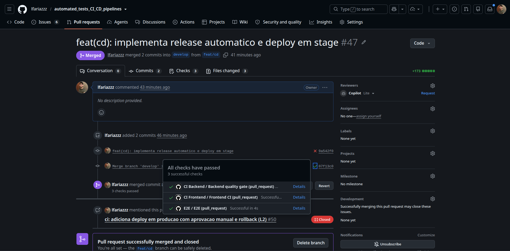
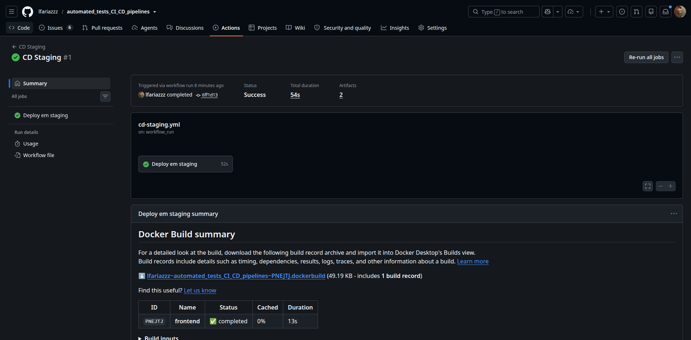
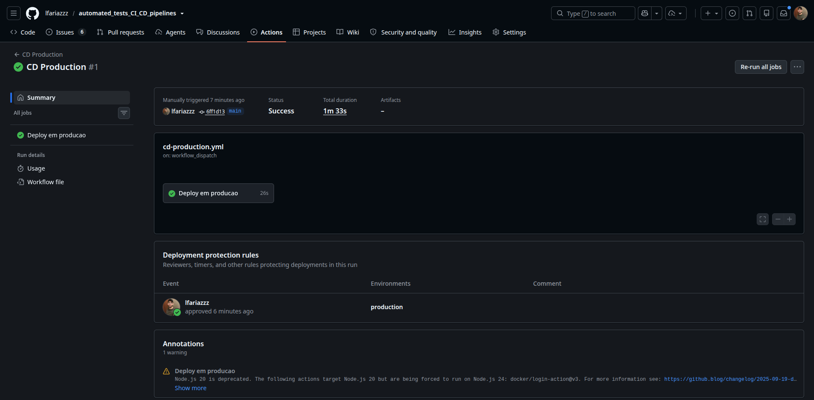

# Evidências das tasks L1 e L2 — Levi

Este documento registra as evidências das duas tasks técnicas do Levi: versionamento
e deploy contínuo em staging (L1) e deploy em produção com aprovação manual e
rollback (L2). Segue o mesmo formato usado em
[`evidencias/henrique.md`](henrique.md) e deve ser incorporado ao
`docs/evidencias.md` consolidado quando o arquivo final for criado (issue #11).

## Resumo executivo

| Task | Entrega técnica | Evidência | Estado |
|---|---|---|---|
| L1 | `release.yml` (versionamento automático) + `cd-staging.yml` (build, push e deploy em staging) | PR #47 mergeado; ciclo completo validado com a tag `v0.0.2` | Concluída |
| L2 | `cd-production.yml` (deploy manual com aprovação via Environment + rollback automático) | PR #51 mergeado; deploy real da `v0.0.2` aprovado e promovido a `stable` | Concluída |

## L1 — Release automático e deploy contínuo em staging

### O que foi implementado

- `.github/workflows/release.yml`: dispara em todo push na `main`; usa
  `mathieudutour/github-tag-action` para calcular a próxima versão semver a partir
  dos commits desde a última tag (Conventional Commits, com `default_bump: patch`
  como fallback), cria a tag e a GitHub Release.
- `.github/workflows/cd-staging.yml`: builda e publica `checkout-backend` e
  `checkout-frontend` no GHCR (tags `sha-<7 chars>` e `vX.Y.Z`, seguindo a
  convenção documentada pelo Henrique em `docs/pipeline/convencao-tags-imagens.md`), sobe um
  deploy simulado em staging via `docker-compose.staging.yml` usando as imagens
  recém-publicadas, e valida com o mesmo healthcheck usado no `e2e.yml`.
- `docker-compose.staging.yml`: cópia do `docker-compose.yml` de desenvolvimento,
  trocando `build:` por `image:` — simula puxar o artefato já publicado, não
  buildar a partir do código-fonte.

### Evidência de aprovação

- [PR #47 — implementação do release e do deploy em staging](https://github.com/lfariazzz/automated_tests_CI_CD_pipelines/pull/47)
  (mergeado em 20/08/2026)
- Checks do PR: `Backend quality gate` ✅, `Frontend CI` ✅, `E2E` ✅

### Evidência do ciclo completo funcionando (release → staging)

Ao mergear a `develop` na `main` pela primeira vez, o `cd-staging.yml` **não
disparou** — descoberta durante a própria validação: pushes/tags criados com o
`GITHUB_TOKEN` padrão não disparam outros workflows (proteção do GitHub contra
loop infinito). Corrigido nos PRs #53/#54, trocando o gatilho de
`push: tags: v*.*.*` para `workflow_run` (dispara quando o `Release` termina com
sucesso).

Depois da correção, o ciclo completo rodou do zero, sem intervenção manual:

| Etapa | Execução | Resultado |
|---|---|---|
| Merge em `main` (PR #54) | — | dispara `Release` |
| `Release` cria a tag `v0.0.2` | [run 32324724243](https://github.com/lfariazzz/automated_tests_CI_CD_pipelines/actions/runs/32324724243) | ✅ sucesso |
| `CD Staging` dispara sozinho via `workflow_run` | [run 32324738292](https://github.com/lfariazzz/automated_tests_CI_CD_pipelines/actions/runs/32324738292) | ✅ sucesso (52s) — build, push no GHCR, deploy em staging e healthcheck |

- [Release `v0.0.2` no GitHub](https://github.com/lfariazzz/automated_tests_CI_CD_pipelines/releases/tag/v0.0.2)

## L2 — Deploy em produção com aprovação manual e rollback

### O que foi implementado

- `.github/workflows/cd-production.yml`: disparo manual (`workflow_dispatch`,
  informando a versão a implantar); usa o Environment `production` para exigir
  aprovação humana antes de rodar; guarda a imagem `stable` atual antes de
  sobrescrever (base do rollback); faz o deploy, valida com healthcheck e, se
  passar, promove a versão a `stable`; se falhar, reimplanta a `stable` anterior
  automaticamente e falha o job de propósito (sinaliza que o deploy não foi bem
  sucedido mesmo com o serviço restaurado).
- Environment `production` configurado em `Settings > Environments`, com
  **Required reviewers**: `lfariazzz` e `davidvital-dev`.

### Evidência de aprovação

- [PR #51 — implementação do deploy em produção](https://github.com/lfariazzz/automated_tests_CI_CD_pipelines/pull/51)
  (mergeado em 20/08/2026)
- Checks do PR: `Backend quality gate` ✅, `Frontend CI` ✅, `E2E` ✅

### Evidência do deploy real em produção

Disparo manual da `v0.0.2` (a mesma versão já publicada em staging pelo L1):

- Run: [32324859591](https://github.com/lfariazzz/automated_tests_CI_CD_pipelines/actions/runs/32324859591)
- Ficou pausado em **"Waiting"**, aguardando aprovação no Environment `production`,
  antes de qualquer passo do job rodar.
- Aprovado por `lfariazzz` (confirmado via API de deployments do run).
- Após aprovação: guardou a `stable` anterior (nenhuma existia ainda — primeiro
  deploy de produção, `docker pull ...:stable` retornou `manifest unknown`,
  tratado como caminho esperado, não erro), fez o deploy da `v0.0.2`, healthcheck
  passou, e promoveu `checkout-backend:v0.0.2` e `checkout-frontend:v0.0.2` a
  `stable` no GHCR (digests confirmados no log).
- Conclusão: ✅ sucesso — job "Deploy em producao" em 26s (duração total do run, 1m33s,
  incluindo o tempo parado esperando aprovação).
- O print abaixo mostra a seção **"Deployment protection rules"** do run, que
  registra explicitamente `lfariazzz approved` no environment `production` —
  confirmação nativa do GitHub de que o gate de aprovação foi respeitado antes do
  job rodar.

> **Nota sobre o cenário de rollback:** o rollback automático (reimplantar a última
> `stable` quando o healthcheck falha) está implementado e coberto pela lógica do
> workflow, mas não foi exercitado numa falha real nesta rodada de evidências — o
> primeiro deploy de produção já passou no healthcheck de primeira. Se o grupo
> quiser uma evidência do rollback em ação, basta disparar o `cd-production.yml`
> apontando para uma versão inexistente no GHCR (o deploy falha, e o rollback para
> a `stable` atual deve disparar automaticamente).
